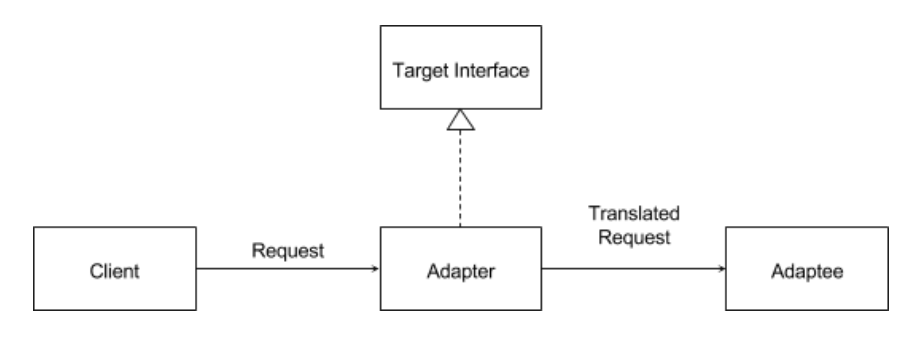

## Adapter Design Pattern
- **[Ahnaf Shahrear Khan](https://github.com/ahnafshahrear)**
- **Computer Science & Engineering, University of Rajshahi**

### Description
- **It is a structural design pattern.**
- **Physically, an adapter is a device that is used to connect pieces of equipment that cannot be connected directly.**
- **The Problem: Not all systems have compatible software interfaces. In other words, the output of one system may not conform to the expected input of another system. This frequently happens when a pre-existing system needs to incorporate third-party libraries or needs to connect to other systems.**
- **The adapter design pattern facilitates communication between two existing systems by providing a compatible interface.**
- **The adapter design pattern consists of several parts:**
  - **A client class. This class is the part of your system that wants to use a third-party library or external system.**
  - **An adaptee class. This class is the third-party library or external system that is to be used.**
  - **An adapter class. This class sits between the client and the adaptee. The adapter conforms to what the client is expecting to see, by implementing a target interface. The adapter also translates the client request into a message that the adaptee will understand and returns the translated request to the adaptee. The adapter is a kind of wrapper class.**
  - **A target interface. This is used by the client to send a request to the adapter.**
- **Implementation of an adapter design pattern:**
  - **Design the target interface.**
  - **Implement the target interface with the adapter class.**
  - **Send the request from the client to the adapter using the target interface.**

### Class Diagram

