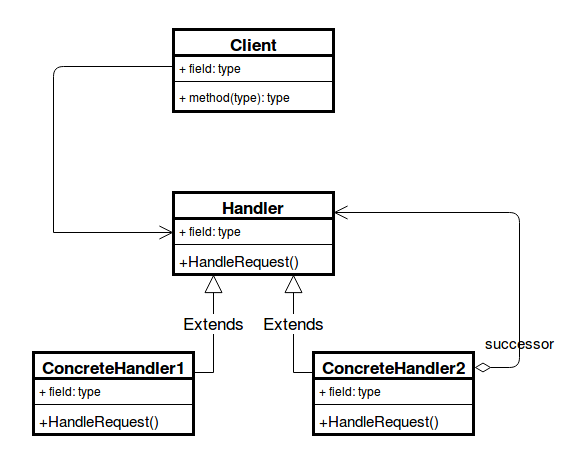

## Chain of Responsibility Pattern
- **[Ahnaf Shahrear Khan](https://github.com/ahnafshahrear)**
- **Computer Science & Engineering, University of Rajshahi**

### Description
- **It is a behavioural design pattern**
- **The chain of responsibility design pattern is a chain of objects that are responsible for handling requests. In software design, these objects are handler objects that are linked together.**
- **When a client object sends a request, the first handler in the chain will try to process it. If the handler can process the request, then the request ends with this handler. However, if the handler cannot handle the request, then the request is sent to the next handler in the chain. This process will continue until a handler can process the request.**
- **The chain of responsibility also helps deal with situations in which streams of different requests need to be handled.**
- **This pattern avoids coupling the sender to the receiver by giving more than one object a chance to handle the request. Whoever sends the request does not need to to worry about who will handle the request, so the sender and the receiver are decoupled from each other.**
- **Each filter needs to go through the following steps:**
  - **Check if the rule matches.**
  - **If it matches, do something specific.**
  - **If it doesn’t match, call the next filter in the list.**

### Class Diagram

