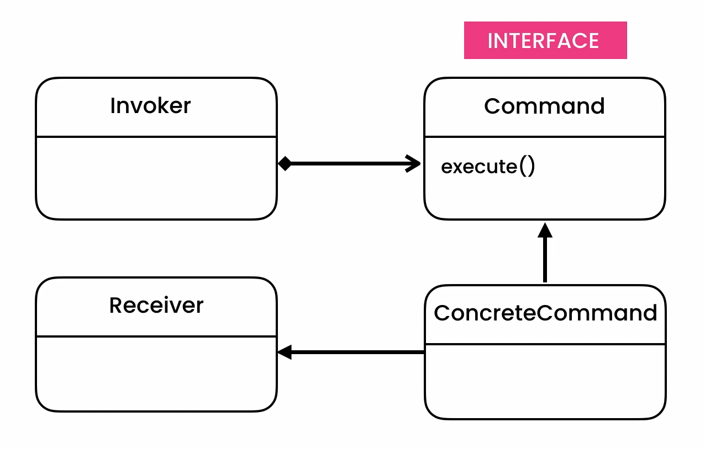

## Command Pattern
- **[Ahnaf Shahrear Khan](https://github.com/ahnafshahrear)**
- **Computer Science & Engineering, University of Rajshahi**

### Description
- **It is a behavioural design pattern.**
- **The command pattern encapsulates a request as an object of its own. In general, when an object makes a request for a second object to do an action, the first object would call a method of the second object and the second object would complete the task. There is direct communication between the sender and receiver object.**
- **The command pattern creates a command object between the sender and receiver. This way, the sender does not have to know about the receiver and the methods to call.**
- **A request is wrapped under an object as command and passed to invoker object. Invoker object looks for the appropriate object which can handle this command and passes the command to the corresponding object which executes the command.**

### Class Diagram

