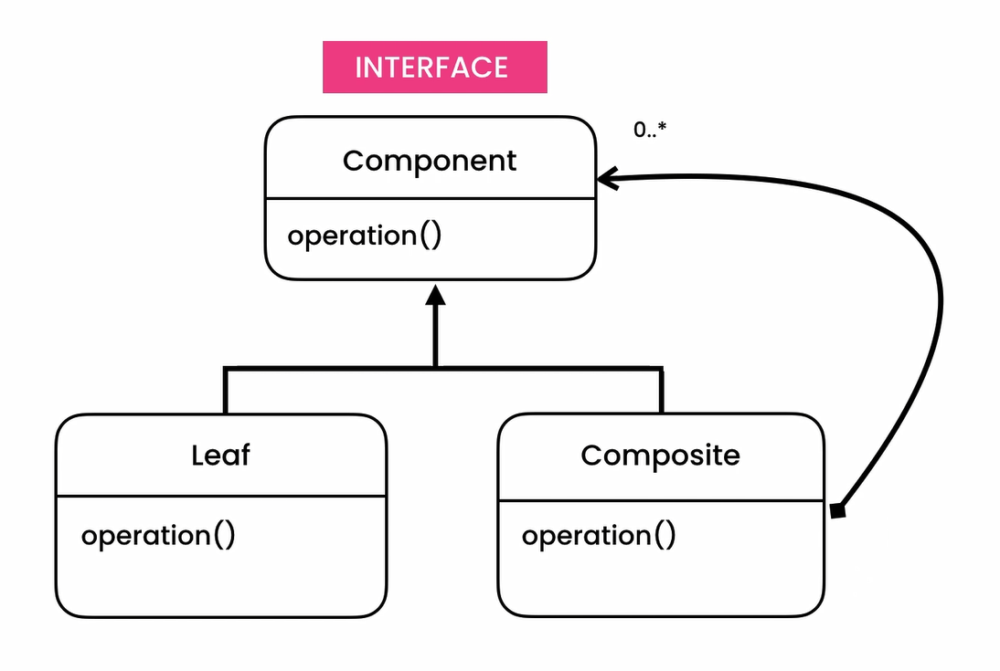

## Composite Pattern
- **[Ahnaf Shahrear Khan](https://github.com/ahnafshahrear)**
- **Computer Science & Engineering, University of Rajshahi**

### Description
- **It is a structural design pattern.**
- **Composite pattern is used where we need to treat a group of objects in a similar way as a single object. Composite pattern composes objects in term of a tree structure to represent part as well as whole hierarchy.**
- **A composite design pattern is meant to achieve two goals:**
  - **To compose nested structures of objects**
  - **To deal with the classes for these objects uniformly**
- **The composite design pattern consists of two parts:**
  - **A leaf class. It represents a non-composite type. It is not composed of other components.**
  - **A composite class. This class is used to aggregate any class that implements the component interface.**
- **The composite design pattern can be broken down into steps:**
  - **Design the interface that defines the overall type.**
  - **Implement the composite class.**
  - **Implement the leaf class**
- **Composite design patterns apply the design principles of decomposition and generalization. They break a whole into parts but the whole and parts both conform to a common type.**

### Class Diagram

