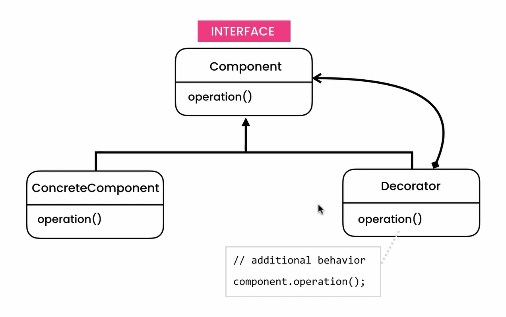

## Decorator Pattern
- **[Ahnaf Shahrear Khan](https://github.com/ahnafshahrear)**
- **Computer Science & Engineering, University of Rajshahi**

### Description
- **It is a structural design pattern.**
- **Decorator pattern allows a user to add new functionality to an existing object without altering its structure. It allows additional behaviours or responsibilities to be dynamically attached to an object, through the use of aggregation to combine behaviours at run time.**
- **Implementation of this design pattern with Java can be broken down into steps:**
  - **Design the component interface.**
  - **Implement the interface with your base concrete component class.**
  - **Implement the interface with your abstract decorator class.**
  - **Inherit from the abstract decorator and implement the component interface with concrete decorator classes.**

### Class Diagram

