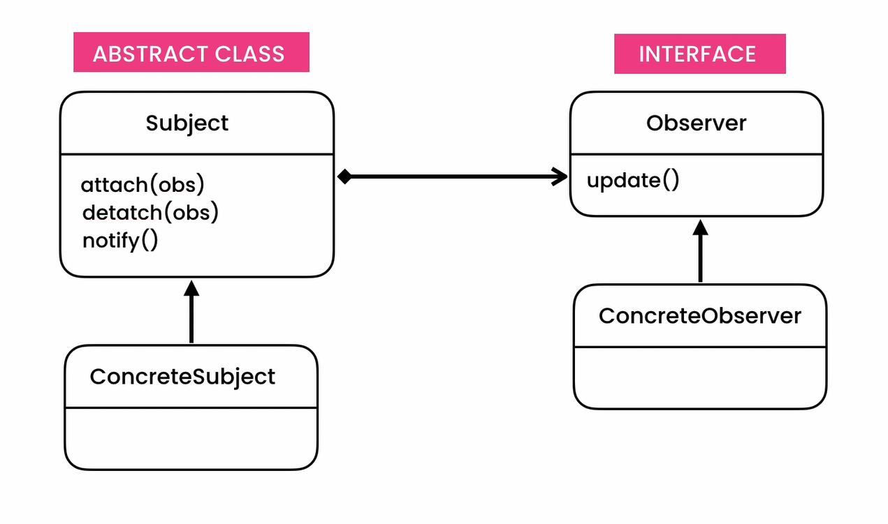

## Observer Pattern
- **[Ahnaf Shahrear Khan](https://github.com/ahnafshahrear)**
- **Computer Science & Engineering, University of Rajshahi**

### Description
- **The observer design pattern is a pattern where a subject keeps a list of observers. Observers rely on the subject to inform them of changes to the state of the subject.**
- **TIn an observer design pattern, there is generally a Subject superclass, which would have an attribute to keep track of all
the observers. There is also an Observer interface with a method so that an observer can be notified of state changes to
the subject. The Subject superclass may also have subclasses that implement the Observer interface. These elements create
the relationship between the subject and observer.**

### Class Diagram
