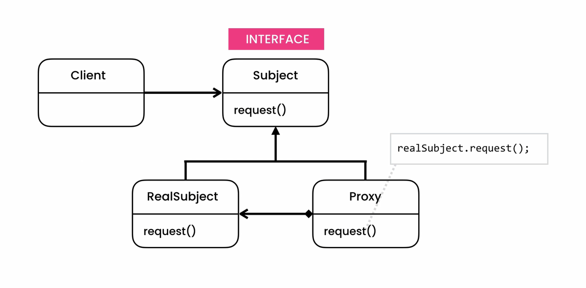

## Proxy Pattern
- **[Ahnaf Shahrear Khan](https://github.com/ahnafshahrear)**
- **Computer Science & Engineering, University of Rajshahi**

### Description
- **It is a structural design pattern.**
- **A proxy design pattern allows a proxy class to represent a real “subject” class. A proxy is something that acts as a simplified, or lightweight version, of the original object. A proxy object can perform the same tasks as an original object but may delegate requests to the original object to achieve them.**
- **In this design pattern, the proxy class wraps the real subject class. This means that a reference to an instance of the real subject class is hidden in the proxy class. The real object is usually a part of the software system that contains sensitive information, or that would be resource-intensive to instantiate. As the proxy class is a wrapper, client classes interact with it instead of the real subject class.**
- **The three most common scenarios where proxy classes are used are:**
  - **To act as a virtual proxy. This is when a proxy class is used in place of a real subject class that is resource-intensive to instantiate.**
  - **To act as a protection proxy. This is when a proxy class is used to control access to the real subject class.**
  - **To act as a remote proxy. This is when a proxy class is local, and the real subject class exists remotely.**
- **The proxy class wraps and may delegate, or redirect, calls upon it to the real subject class. However, not all classes are delegated, as the proxy class can handle some of its lighter responsibilities. Only substantive requests are sent to the real subject class. Because of this, the proxy class must offer the same methods. Having both these classes implement a common subject interface allows for polymorphism.**
- **Implementation of this pattern in Java can be broken down into steps:**
  - **Design the subject interface.**
  - **Implement the real subject class.**
  - **Implement the proxy class.**

### Class Diagram

