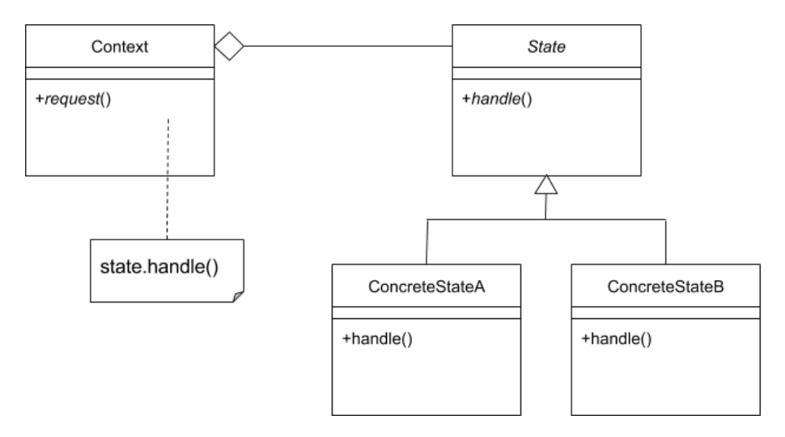

## State Pattern
- **[Ahnaf Shahrear Khan](https://github.com/ahnafshahrear)**
- **Computer Science & Engineering, University of Rajshahi**

### Description
- **It is a behavioural design pattern**
- **Objects in the code are aware of their current state. They can choose an appropriate behaviour based on their current state. When their current state changes, this behaviour can be altered - this is the State Design Pattern.**
- **This pattern should be primarily used when we need to change the behaviour of an object based upon changes to it's internal state or the state it is in at run-time.**

### Class Diagram

