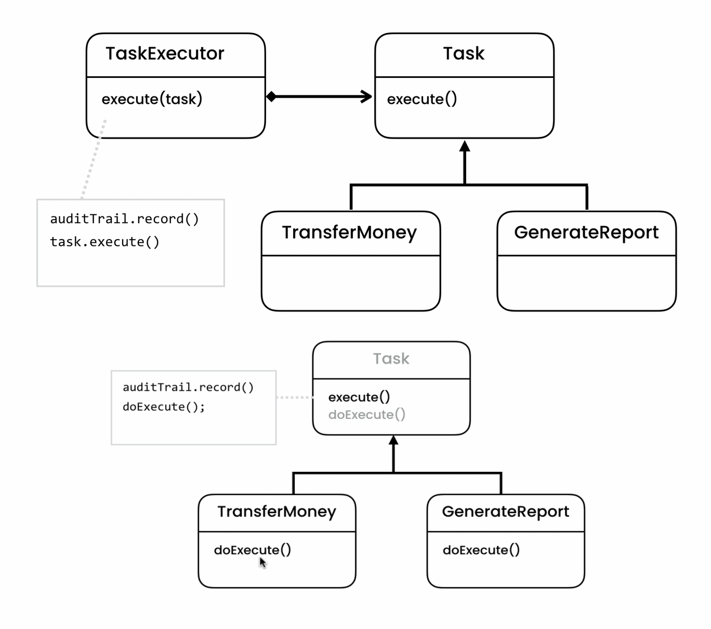

## Bakning Activity Recorder using Template Method Pattern
- **[Ahnaf Shahrear Khan](https://github.com/ahnafshahrear)**
- **Computer Science & Engineering, University of Rajshahi**

### Description
- **Objects in the code are aware of their current state. They can choose an appropriate behavior based on their current state. When their current state changes, this behavior can be altered - this is the State Design Pattern.**
- **This pattern should be primarily used when we need to change the behavior of an object based upon changes to it's internal state or the state it is in at run-time.**

### Class Diagram
