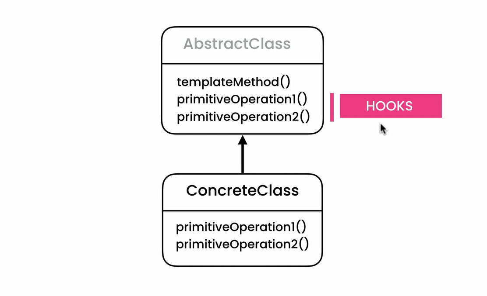

## Template Method Pattern
- **[Ahnaf Shahrear Khan](https://github.com/ahnafshahrear)**
- **Computer Science & Engineering, University of Rajshahi**

### Description
- **It is a behavioural design pattern.**
- **The template method pattern defines an algorithm’s steps generally, by deferring the implementation of some steps to subclasses. In other words, it is concerned with the assignment of responsibilities.**
 

### Class Diagram

